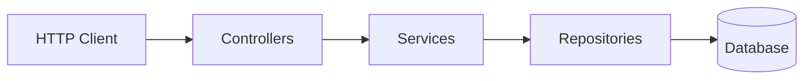

# ЛР-7 — Документация по интерфейсам и алгоритмам

- **220 — Архитектура**
- **230 — Сервисы (API и внутренние интерфейсы)**

---

# 220 — Архитектура

## 1. Назначение
Backend-сервис аренды автомобилей:
- учет клиентов
- каталог автомобилей
- поиск доступных авто на период
- создание/просмотр/отмена бронирований

## 2. Слои и ответственность

**Слои:**
- **Controllers (API)** — HTTP маршруты, DTO, валидация, маппинг ошибок.
- **Services (Business)** — правила и алгоритмы.
- **Repositories (Data access)** — запросы к БД.
- **Domain/Entities** — сущности предметной области.

## 3. Компонентная схема



## 4. Модель данных

### 4.1 Client
- `client_id`
- `full_name`
- `passport_data`
- `login`
- `password_hash`
- `email`
- `phone`
- `address`
- `birth_date`
- `driver_license_number`
- `client_status`

### 4.2 Car
- `car_id`
- `plate_number`
- `brand`
- `model`
- `daily_cost`
- `status` (`available | unavailable`)
- `insurance_cost` 
- `prod_year` 

### 4.3 Reservation
- `rental_id`
- `client_id`
- `car_id`
- `date_from`
- `date_to`
- `status` (`pending | confirmed | canceled | completed`)
- `daily_rate_at_booking`
- `total_amount`
- `penalty_amount`
- `deposit_amount`

## 5. Алгоритмы

### 5.1 Алгоритм `isCarAvailable(carId, dateFrom, dateTo)`

Псевдокод:
```
function isCarAvailable(carId, dateFrom, dateTo):
    bookings = bookingRepository.findActiveByCarId(carId)
    for b in bookings:
        if b.dateFrom <= dateTo and b.dateTo >= dateFrom:
            return false
    return true
```

### 5.2 Алгоритм `listAvailableCars(dateFrom, dateTo, filters)`

Псевдокод:
```
function listAvailableCars(dateFrom, dateTo, filters):
    validate(dateFrom <= dateTo)
    cars = carRepository.findActive(filters)
    result = []
    for car in cars:
        if isCarAvailable(car.id, dateFrom, dateTo):
            result.add(car)
    return result
```

### 5.3 Алгоритм `createBooking(clientId, carId, dateFrom, dateTo)`

Псевдокод:
```
function createBooking(clientId, carId, dateFrom, dateTo):
    validate(dateFrom <= dateTo)
    client = clientRepository.findById(clientId) else 404
    car = carRepository.findById(carId) else 404
    ensure car.status == ACTIVE else 409/400
    ensure isCarAvailable(carId, dateFrom, dateTo) else 409
    booking = Booking(clientId, carId, dateFrom, dateTo, status=CREATED)
    return bookingRepository.save(booking)
```

### 5.4 Алгоритм `cancelBooking(clientId, bookingId)`

Псевдокод:
```
function cancelBooking(clientId, bookingId):
    booking = bookingRepository.findById(bookingId) else 404
    ensure booking.clientId == clientId else 403
    if booking.status == CANCELLED:
        return booking
    booking.status = CANCELLED
    return bookingRepository.save(booking)
```

## 6. Ошибки (коды)
- `400` — валидация (даты/формат)
- `401` — нет/невалидный токен
- `403` — нет прав (чужое бронирование)
- `404` — сущность не найдена
- `409` — конфликт (авто недоступно)
- `500` — неожиданная ошибка

---

# 230 — Сервисы

## 1. Общие правила API
- Формат: JSON (`application/json`)
- Базовый префикс: `/api/v1`
- Авторизация: `Authorization: Bearer <JWT>`
- Health: `GET /health`

## 2. Эндпоинты

### 2.1 Health
**GET** `/health`  
проверка доступности сервиса.

**Response**
```http
200 OK
Content-Type: application/json

{ "status": "ok" }
```

---

### 2.2 Auth

#### 2.2.1 Register
**POST** `/api/v1/auth/register`  
регистрация нового клиента.

**Request**
```http
POST /api/v1/auth/register
Content-Type: application/json

{
  "fullName": "Иван Иванов",
  "passportData": "1234 567890",
  "login": "user1",
  "password": "secret",
  "email": "user1@mail.com",
  "phone": "+49123456789",
  "address": "Frankfurt"
}
```

**Response**
```http
201 Created
Content-Type: application/json

{ "client_id": 123 }
```

Ошибки: `400`, `409`

#### 2.2.2 Login
**POST** `/api/v1/auth/login`  
аутентификация, получение JWT.

**Request**
```http
POST /api/v1/auth/login
Content-Type: application/json

{ "login": "user1", "password": "secret" }
```

**Response**
```http
200 OK
Content-Type: application/json

{ "token": "jwt" }
```

Ошибки: `400`, `401`

#### 2.2.3 Password recovery
**POST** `/api/v1/auth/password-recovery`  
получение токена восстановления пароля по email (TTL 900 сек).

**Request**
```http
POST /api/v1/auth/password-recovery
Content-Type: application/json

{ "email": "user1@mail.com" }
```

**Response**
```http
200 OK
Content-Type: application/json

{ "token": "recovery-token", "ttlSec": 900, "ttl_sec": 900 }
```

Ошибки: `400`

#### 2.2.4 Logout (protected)
**POST** `/api/v1/auth/logout`  
выход.

**Request**
```http
POST /api/v1/auth/logout
Authorization: Bearer <JWT>
```

**Response**
```http
200 OK
Content-Type: application/json

{ "status": "ok" }
```

Ошибки: `401`

---

### 2.3 Cars

#### 2.3.1 List available cars
**GET** `/api/v1/cars`  
список доступных автомобилей.  
Поведение:
- без параметров — доступные на период **[today, today+1 day)**;
- с параметрами — доступные на период **[date_from, date_to)**.

Query:
- `date_from=YYYY-MM-DD`
- `date_to=YYYY-MM-DD`

**Request**
```http
GET /api/v1/cars?date_from=2026-03-01&date_to=2026-03-02
```

**Response**
```http
200 OK
Content-Type: application/json

[
  {
    "carId": 1,
    "plateNumber": "A-BC-1234",
    "brand": "Toyota",
    "model": "Camry",
    "status": "available",
    "dailyCost": 80.00,
    "insuranceCost": 10.00,
    "prodYear": 2020
  }
]
```

Ошибки: `400`

#### 2.3.2 Get car by id
**GET** `/api/v1/cars/{id}`  
получить автомобиль по идентификатору.

**Request**
```http
GET /api/v1/cars/1
```

**Response**
```http
200 OK
Content-Type: application/json

{
  "carId": 1,
  "plateNumber": "A-BC-1234",
  "brand": "Toyota",
  "model": "Camry",
  "status": "available",
  "dailyCost": 80.00,
  "insuranceCost": 10.00,
  "prodYear": 2020
}
```

Ошибки: `400`, `404`

---

### 2.4 Reservations (protected)

#### 2.4.1 Create and confirm reservation
**POST** `/api/v1/reservations`  
создать резервацию и установить статус `confirmed`.

**Request**
```http
POST /api/v1/reservations
Authorization: Bearer <JWT>
Content-Type: application/json

{ "carId": 1, "dateFrom": "2026-03-01", "dateTo": "2026-03-05" }
```

**Response**
```http
201 Created
Content-Type: application/json

{
  "rentalId": 1001,
  "clientId": 123,
  "fullName": "Иван Иванов",
  "carId": 1,
  "plateNumber": "A-BC-1234",
  "brand": "Toyota",
  "model": "Camry",
  "dateFrom": "2026-03-01",
  "dateTo": "2026-03-05",
  "status": "confirmed",
  "dailyRateAtBooking": 80.00,
  "totalAmount": 320.00,
  "penaltyAmount": 0.00,
  "depositAmount": 200.00
}
```

Ошибки: `400`, `401`, `403`, `409`

#### 2.4.2 List my reservations
**GET** `/api/v1/reservations/me`  
получить список резерваций текущего клиента.

**Request**
```http
GET /api/v1/reservations/me
Authorization: Bearer <JWT>
```

**Response**
```http
200 OK
Content-Type: application/json

[
  {
    "rentalId": 1001,
    "clientId": 123,
    "fullName": "Иван Иванов",
    "carId": 1,
    "plateNumber": "A-BC-1234",
    "brand": "Toyota",
    "model": "Camry",
    "dateFrom": "2026-03-01",
    "dateTo": "2026-03-05",
    "status": "confirmed",
    "dailyRateAtBooking": 80.00,
    "totalAmount": 320.00,
    "penaltyAmount": 0.00,
    "depositAmount": 200.00
  }
]
```

Ошибки: `401`

#### 2.4.3 Get my reservation by id
**GET** `/api/v1/reservations/{id}`  
получить одну резервацию текущего клиента по идентификатору.

**Request**
```http
GET /api/v1/reservations/1001
Authorization: Bearer <JWT>
```

**Response**
```http
200 OK
Content-Type: application/json

{
  "rentalId": 1001,
  "clientId": 123,
  "fullName": "Иван Иванов",
  "carId": 1,
  "plateNumber": "A-BC-1234",
  "brand": "Toyota",
  "model": "Camry",
  "dateFrom": "2026-03-01",
  "dateTo": "2026-03-05",
  "status": "confirmed",
  "dailyRateAtBooking": 80.00,
  "totalAmount": 320.00,
  "penaltyAmount": 0.00,
  "depositAmount": 200.00
}
```

Ошибки: `400`, `401`, `404`

#### 2.4.4 Cancel reservation
**DELETE** `/api/v1/reservations/{id}`  
отменить резервацию (установить статус `canceled`).

**Request**
```http
DELETE /api/v1/reservations/1001
Authorization: Bearer <JWT>
```

**Response**
```http
200 OK
Content-Type: application/json

{ "rental_id": 1001, "status": "canceled" }
```

Ошибки: `400`, `401`, `404`

## 3. Внутренние интерфейсы 

### 3.1 AuthService
- `register(login, password) -> Client`
- `login(login, password) -> TokenDto`

### 3.2 CarService
- `listCars(filters) -> List<CarDto>`
- `listAvailable(dateFrom, dateTo, filters) -> List<CarDto>`
- `isAvailable(carId, dateFrom, dateTo) -> boolean`

### 3.3 ReservationsService
- `createReservation(clientId, carId, dateFrom, dateTo) -> BookingDto`
- `listMyReservations(clientId) -> List<BookingDto>`
- `cancelReservation(clientId, bookingId) -> BookingDto`

### 3.4 Repositories
- `ClientRepository`: `findByLogin`, `findById`, `save`
- `CarRepository`: `findActive(filters)`, `findById`
- `BookingRepository`: `findActiveByCarId`, `findByClientId`, `findById`, `save`

## 4. Конфигурация
- `DB_URL`
- `DB_USER`
- `DB_PASSWORD`
- `JWT_SECRET`
- `JWT_TTL_SECONDS`
- `SERVER_PORT`
